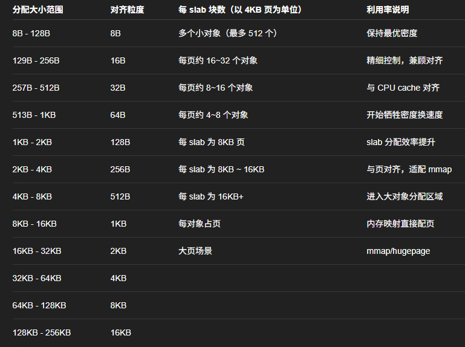
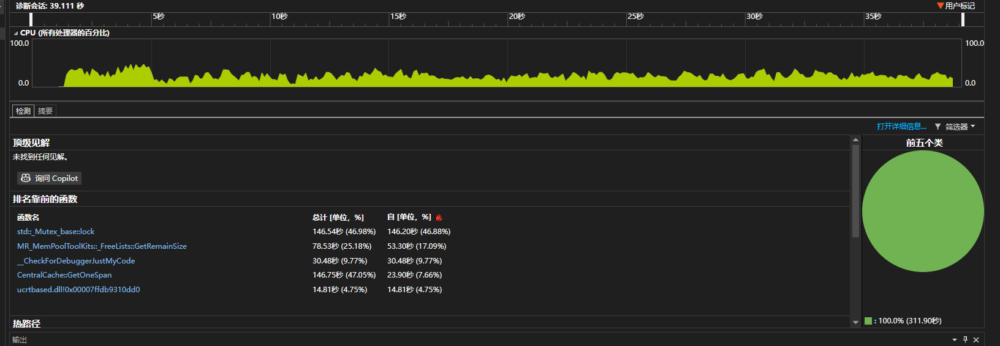

## MR_malloc内存池项目

### 项目介绍：终版

**创建时间：2025.05.16**

**名称：高性能内存池V3.0终版**

**说明：经过一系列更新 终版的MR_malloc支持多线程运行 参照tcmalloc的部分设计原理构造了多 级线程缓存的内存池 通过层层缓存提高了动态内存分配和释放的效率 在几个关键地方：**

**1.桶锁和页缓存锁采用自定义的自旋锁 并设置指数退避策略和随机时间等待 使其具有抖动性**

**2.为减少锁的使用 在建立页号和span对象的映射关系中采用了三层基数树 O(1)查询效率的情况下可在基数树建立映射的过程中读取其余的值 不会像map等线程不安全结构因扩容带来的迭代器失效而频繁加锁**

**3.内存池完全脱离malloc和free 底层直接对系统调用**

**本项目主要功能是为了给频繁请求和释放内存的线程提供更高效的操作，主要原理是缓存了内存 且对申请的块按一定规则进行内存对齐，从而减少了内存外碎片的产生，在内存池的设计上，从对齐位数设计到内内存碎片率优化降低设计以及很多细节之处不一一展开，代码部分都有必要的注释，后续本人有时间再来详细写一下 **

### 一、项目设计思路

##### 1.项目架构

参考网上对tcmalloc设计的解析，本多级缓存的设计思路也参照tcmalloc进行设计，总体架构如下图所示


##### 2.大块内存下的内存对齐规则和分配规则

在操作系统中malloc分配方式为低于128KB的内存请求按照brk()移动堆指针来实现，大于128KB的内存请求则通过mmap()映射文件和匿名页来获得内存，前者的好处自然是更简单，且自带回收机制，free的时候不必还给操作系统，而mmap则会返还给操作系统，调用mmap次数过多后就会导致CPU开销较大，由于在不同的业务场景中也有可能会涉及到使用超大的页内存，例如数据库页等，因此一个合格的内存池必须考虑设计128KB以下和128KB以上的内存分配，但由于内存池本身**不能过度设计**，也就是设计思路围绕单次申请的内存不超过256KB的情况，当大于256KB的情况就交给系统的malloc函数

tcmalloc的官方对齐规则并不是256KB内的所有块都按照8B的方式对齐，也就是说在某一范围内是8B，随后变为16B、128B、1024B、8*1024B规则，按照这个规则从1B~256KB原本26万多个分配节点（桶）只用160个桶即可解决，tcmalloc的具体分配规则如下：


这种分配范围和对齐粒度有自己的使用场景和优势，但考虑到前1KB的分配其实可以更为细化，考虑到操作系统内部采用了SLAB分配器来管理页内存的小块内存，所以分配的粒度不能太高，最大不能超过512个小对象，因此本项目采用的分配范围和对齐粒度如下：



采用这种分配方式和对齐规则只需要104个桶，相对来讲内存池本身所占的空间更小，且对于小块内存的空间利用率更高，那么对于_freelists的定义则为如下方式：

```cpp
// FREELISTSIZE = 104
void* _freelists[FREELISTSIZE];
```

那么确定了对齐规则， 我们就需要来根据请求的内存大小来计算对应桶的下标和对齐规则

##### 3.ThreaCache的设计

**（1）static _declspec(thread)的引入**

正常情况下，一个主程序中多线程使用ThreadCache类时需要手动的去定义ThreadCache实例（至少需要不同的对象名），需要手动管理线程和实例之间的关系，而TLS本地线程静态局部存储声明可以使得在不同的线程下自动的有自己对应的实例，方便全局访问，不用手动传参或管理生命周期。对应声明方式通常由如下两种，第一种弊端在于会多创建一个全局主线程变量，第二个弊端在于当前线程退出后不会自动调用析构函数，无法回收内存

```cpp
// 方式一
static __declspec(thread) ThreadCache tls_threadcache;
// 方式二
static __declspec(thread) ThreadCache* tls_threadcache = nullptr;
```

目前最好的方式是采用智能指针unique_ptr<T>，使得智能指针自动管理线程的指针变量，这样在线程退出的时候可以自动调用析构函数从而回收内存

```cpp
// 全局声明时
static _declspec(thread) std::unique_ptr<ThreadCache> tls_threadcache = nullptr;
// 调用时
if (tls_threadcache == nullptr)
	tls_threadcache = std::make_unique<ThreadCache>();
```


##### 4.CentralCache的设计

这里注意，**CentralCache向PageCache申请Span的时候需要和你申请的小块内存块进行一个最小公倍数计算**，例如你申请的实际内存是9KB，但page一页是4KB，如果你申请的Span是管理3页的，那你对应的Span大小为12KB，虽然能满足本次小块内存申请要求，但会造成内部内存碎片，也就是这剩下的12 - 9 = 3KB就被浪费掉了，而外部内存碎片由于内存池的管理，释放了就还回来，不存在释放了的内存无法使用，因此外部内存碎片被很好的解决了，经过测试，内部Span页内存碎片率采用这种方式可降低到0%


略

##### 5.PageCache的设计

略

### **二、性能分析**

问题1：



问题2：


上述耗时的地方在于加解锁以及判断CentralCache中Span里面是否还有可用内存，锁可改为轻量级的自旋锁，并加入指数退避方法，优化后效率提升x%，加解锁太频繁，可将减少不必要的加解锁，然后将map改为自己设计的基数树，在不影响查询效率的情况下减少了加解锁，因此对ReleaseSpan的提升较多，优化约为y%


最终优化版本：

benchmark测试代码见benchmark.cpp

```cpp
// 测试用数据集
// 伪随机方式 rand() % i
// 在 n = 256*1024 + 1的情况下系统malloc太费时 但本内存池表现仍然较好
size_t n = 29981;
vector<int> nums(n, 0);
for (int i = 1; i < n; i++) {
	nums[i] = rand() % i;
}
// 5轮 8 线程 每轮n次申请和释放 
cout << "==========================================================" << endl;
BenchmarkMalloc(n, 8, 5,nums);

cout << "==========================================================" << endl;
BenchmarkMR_malloc(n, 8, 5,nums);
```

debug情况下：


release情况下：


本项目：


其余博主：

知乎：https://zhuanlan.zhihu.com/p/709945576


申请速度提高了好几倍，相比于初版，即使是现在的n = 256*1024 + 1，效果也非常好，与网上常见的其余博主的内存池项目相比，本项目性能较佳，但在某些情况下，例如线程竞争激烈、申请释放的内存总并发较大情况下，可能会因为自旋锁的指数退避策略导致性能和系统malloc接近，这方面还需要诸多的测试来不断修正优化内存池


